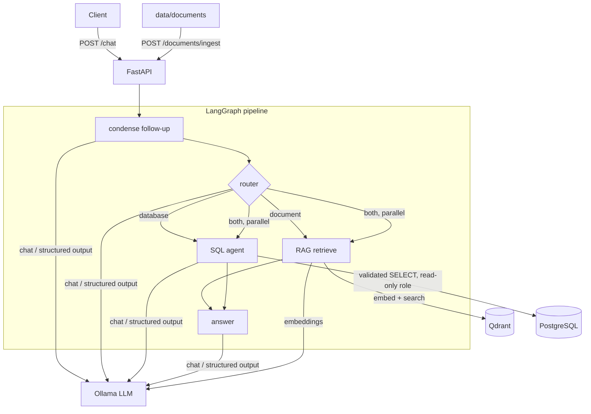

# Local GenAI Data Assistant

Chat with **documents** (RAG) and **PostgreSQL data** (text-to-SQL) using a fully local stack.
No business data leaves your machine: LLM and embeddings run in Ollama, vectors in Qdrant, rows in PostgreSQL.

## Quick start

```bash
cp .env.example .env        # optional: change passwords / models
docker compose up --build
```

First run pulls the models (`llama3.1:8b` ≈ 4.7 GB, `nomic-embed-text` ≈ 270 MB) via the one-shot `ollama-init` service;
the API starts after that and auto-indexes `data/documents/`. Watch progress with `docker compose logs -f api`.

- Test UI (Streamlit chat, sources, SQL + rows, document upload/delete): http://localhost:8501
- Swagger UI / API docs: http://localhost:8000/docs
- **Memory:** `llama3.1:8b` needs ~6 GB free for Docker. On Docker Desktop with less (default VM can be ~4 GB) it is OOM-killed (`signal: killed` in the ollama log) — either raise Docker Desktop's memory or use the smaller model: put `CHAT_MODEL=llama3.2:3b` in `.env` (tested; good enough for the demo questions, weaker on complex SQL).
- GPU: uncomment the `deploy` block on the `ollama` service in `docker-compose.yml`.

```bash
curl -s localhost:8000/chat -H 'content-type: application/json' \
  -d '{"message":"What is the company leave policy?"}' | jq
curl -s localhost:8000/chat -H 'content-type: application/json' \
  -d '{"message":"Which are the top 5 customers by revenue?"}' | jq
curl -s localhost:8000/chat -H 'content-type: application/json' \
  -d '{"message":"What is the refund policy and how much was refunded last month?"}' | jq
```

## Architecture



| Layer | Choice |
|---|---|
| API | FastAPI (`app/main.py`) |
| Orchestration | LangGraph `StateGraph` (`app/graph.py`) |
| LLM / embeddings | Ollama: `llama3.1:8b`, `nomic-embed-text` |
| Vector DB | Qdrant, cosine, one point per chunk with `filename/page/chunk_index` payload |
| SQL | PostgreSQL 16, `sqlglot` validator, `psycopg` |

### Request flow
1. **condense** – if the session has history, the LLM rewrites the follow-up ("and sick days?") into a standalone question.
2. **router** – LLM structured output (`RouteDecision`: `document | database | both` plus a sub-question for each side). If the LLM call fails, a keyword heuristic takes over.
3. **rag** / **sql** – run alone or *in parallel* for `both`.
4. **answer** – one LLM call over `<documents>` and `<sql_result>` context; cites source files. Response also returns the sources and the executed SQL with its rows.

### RAG (`app/documents.py`, `app/retrieval.py`, `app/vectorstore.py`)
1. **Section-aware chunking.** PDF (page-aware) and TXT: recursive splitting (`CHUNK_SIZE`/`CHUNK_OVERLAP`).
   Markdown and DOCX: split on headings (Markdown `#`..`######`, ignoring `#` lines inside code fences; DOCX `Title`/`Heading 1..N` styles; the table of contents is not indexed); one chunk per section, split further only if larger than `CHUNK_SIZE`, and every piece keeps its heading metadata. A document with no headings falls back to one un-headed section, chunked like plain text — heading structure is detected generically, never assumed or hardcoded per file.
   The embedded text is `filename > Parent > Section` + body, so, e.g., "Prisma 7" is anchored to "Database" wherever that heading appears, in any document.
2. **Metadata** in each Qdrant point: `doc_id, filename, file_type, page, chunk_index, text, section, heading, heading_path, chunker_version, ingested_at`. `/chat` sources expose `section` and `heading` (optional fields). Documents indexed by an older chunker are re-embedded automatically at startup (`chunker_version`).
   **DOCX** headings (Word's `Title`/`Heading 1..N` paragraph styles) are converted to the same `#`/`##` structure and reuse the identical Markdown section splitter, so a `.docx` with headings gets the same section-aware chunking as a `.md` file, with no format-specific logic duplicated. A document with no headings at all (`.docx` or `.md`) falls back to one un-headed section, chunked like plain text.
3. **Candidate retrieval.** One query embedding -> `RETRIEVAL_CANDIDATE_K` (10) nearest chunks. Vague concept words are expanded for the embedding (`framework` -> "tech stack technology").
4. **Semantic + keyword ranking.** `final = SEMANTIC_WEIGHT * cosine + KEYWORD_WEIGHT * keyword (+ FILENAME_BOOST)`. The keyword score is the weighted share of the query's informative terms found in the chunk (case-insensitive, plural-normalised, stopwords ignored; rarer and technical terms such as ORM, Prisma, pnpm weigh more; a term in the section heading counts extra).
5. **Filename-aware.** Naming an indexed document (`CLAUDEEE.md`, `refund_policy`, case-insensitive) restricts retrieval to it (a full candidate pool of its own); other documents are used only if it yields nothing.
6. **Relevance check.** A chunk is kept only if it has semantic >= `SEMANTIC_FLOOR` **and** (semantic >= `RAG_MIN_SCORE`, or keyword >= `KEYWORD_MIN_SCORE`, or it is from a named document). No qualifying chunk -> no context -> the assistant says it found nothing (the LLM is not called).
7. **Selection.** Best chunks within `RELATIVE_CUTOFF` of the top score (looser `BROAD_RELATIVE_CUTOFF` for broad questions such as "what are the rules..."), at most `MAX_CHUNKS_PER_SECTION` per section, at most `TOP_K` (`BROAD_TOP_K` for broad questions).
8. **Grounding.** The answer prompt allows only the retrieved context, forbids inference/invention, and requires an explicit "not enough information" reply; `[file]` citations of files that were not retrieved are stripped.

**Debugging retrieval:** set `RAG_DEBUG=true` (e.g. in `.env`) to log every candidate (KEEP/DROP, section, semantic, keyword, final, matched terms) and to include a `debug` object in each source (shown in the Streamlit UI). Off by default; never enable it for end users.

| Setting | Default | Meaning |
|---|---|---|
| `RETRIEVAL_CANDIDATE_K` | 10 | semantic candidates fetched |
| `TOP_K` / `BROAD_TOP_K` | 4 / 6 | final context size (normal / broad questions) |
| `SEMANTIC_WEIGHT` / `KEYWORD_WEIGHT` / `FILENAME_BOOST` | 0.7 / 0.3 / 0.25 | ranking weights |
| `RAG_MIN_SCORE` / `KEYWORD_MIN_SCORE` / `SEMANTIC_FLOOR` | 0.6 / 0.5 / 0.35 | relevance gates |
| `RELATIVE_CUTOFF` / `BROAD_RELATIVE_CUTOFF` | 0.8 / 0.6 | drop chunks scoring below this fraction of the best |
| `MAX_CHUNKS_PER_SECTION` | 2 | section diversity |

### Routing and follow-ups (`app/routing.py`, `app/condense.py`)
- **Router.** Keyword rules first: business nouns (customers, orders, revenue, refunded amounts, stock...) mean *database*; document/technical-documentation vocabulary (policies, leave, ORM, framework, frontend, coding rules, installation, configuration, pricing/billing, "the project", file names like `X.md`...) means *documents*; both means *both*. Technical words alone ("ORM", "database", "SQL", "schema", "PostgreSQL") never mean *database*. The LLM router only decides questions with neither signal, and its prompt says the same. For a single-intent question, only the *route* choice is taken from the LLM — the retrieved/queried text is always the user's own (standalone) question, never the model's rewritten `doc_question`/`db_question`, which a small model can paraphrase into an unrelated question when no actual split is needed. The model's split is used only when the route is genuinely `both`.
- **Condensation.** The current question is the source of truth. History is used only when the question cannot stand alone (no specific terms of its own such as "What is the time limit?", or an unresolved pronoun like "What do they eat?"); everything else is preserved as typed. A rewrite must keep every original word and may only add words from the recent conversation; otherwise a deterministic fallback is used. Security-sensitive input is never rewritten.

### SQL agent (`app/sql_agent.py`, `app/sql_validator.py`)
- **Schema-aware prompt**: live column introspection + business rules (what "revenue" means, what "last month" means) + few-shot examples.
- **Structured output**: model must return `{"sql": "..."}`.
- **Validation** (`sqlglot`, fail-closed): one statement, root must be SELECT/UNION, no DML/DDL/`INTO`/`FOR UPDATE`, table allowlist, no `pg_*`/`dblink`/table functions, comments stripped, `LIMIT` injected. The *re-generated* SQL is what runs.
- **Defense in depth**: executes as role `assistant_ro` (SELECT on 5 tables only) inside a `READ ONLY` transaction with `statement_timeout`; row cap on fetch.
- **Self-repair**: one retry, feeding the validation/DB error back to the model.
- **Query logging**: every attempt (ok / rejected / error) goes to the app log and to table `query_log` (written by the admin role; invisible to the read-only role).

```sql
SELECT asked_at, status, question, generated_sql FROM query_log ORDER BY id DESC LIMIT 10;
```

### Security & error handling
- Untrusted-data framing: document and SQL text is delimited, delimiter tags are stripped from documents, system prompt says never to follow instructions found in context; injection-looking user input is logged.
- Input limits: message ≤ 2000 chars, control chars stripped, upload ≤ 10 MB, extension allowlist, filename sanitised (no path traversal), session id pattern-checked.
- Generic error messages to clients (details only in logs); LLM outage → `503`, SQL/retrieval failures degrade to an answer that says the data was unavailable.
- Ports are bound to `127.0.0.1`; API container runs as non-root; Qdrant telemetry disabled.
- Note: conversation memory is in-process (bounded LRU) – it resets on restart and is not shared across replicas.

## API
See [docs/API.md](docs/API.md) or the live Swagger UI at `/docs`.

| Method | Path | Purpose |
|---|---|---|
| POST | `/chat` | Ask a question (`message`, optional `session_id`) |
| POST | `/documents/ingest` | Upload one file, or no body to index `data/documents/` (`?force=true` re-embeds) |
| GET | `/documents` | List indexed documents |
| DELETE | `/documents/{id}` | Remove vectors and the file |
| GET | `/health` | Status of Qdrant, Ollama, PostgreSQL |

## Data
- `data/documents/`: 10 samples covering every supported format – leave policy (md), refund policy (md), remote work (txt), shipping FAQ (md), security policy (docx), warranty & support (pdf), a technical Markdown doc, a deployment guide (txt), an authentication guide (md), an equipment guide (docx) and a pricing policy (pdf). `python scripts/generate_sample_docs.py` regenerates the generated docx/pdf files.
- `db/`: `01_schema.sql` (customers, products, orders, order_items, refunds, query_log), `02_seed.sql` (20 customers, 15 products, 300 orders with dates relative to today, refunds incl. last month), `03_roles.sh` (read-only role). These run only when the `pgdata` volume is empty; `docker compose down -v` to reseed.

## Tests
```bash
python -m venv .venv && . .venv/bin/activate
pip install -r requirements-dev.txt
pytest
```
Covers the SQL validator (injection/DDL/DML/catalog access), loaders/chunking, LangGraph routing & fallback with injected fakes, conversation store, and all API endpoints (fake graph/store). No Ollama/Docker needed.

## Project layout
```
app/           main.py graph.py sql_agent.py sql_validator.py vectorstore.py documents.py
               llm.py memory.py security.py config.py models.py schemas.py
db/            schema, seed, roles
data/documents sample files
tests/         pytest suite
docs/API.md    endpoint reference
```

## Known limits
- 8B local models occasionally write imperfect SQL; the retry loop and the shown SQL/rows make this visible. Larger models via `CHAT_MODEL` improve it.
- No auth on the API (local demo). Put it behind a reverse proxy with auth before exposing beyond localhost.
