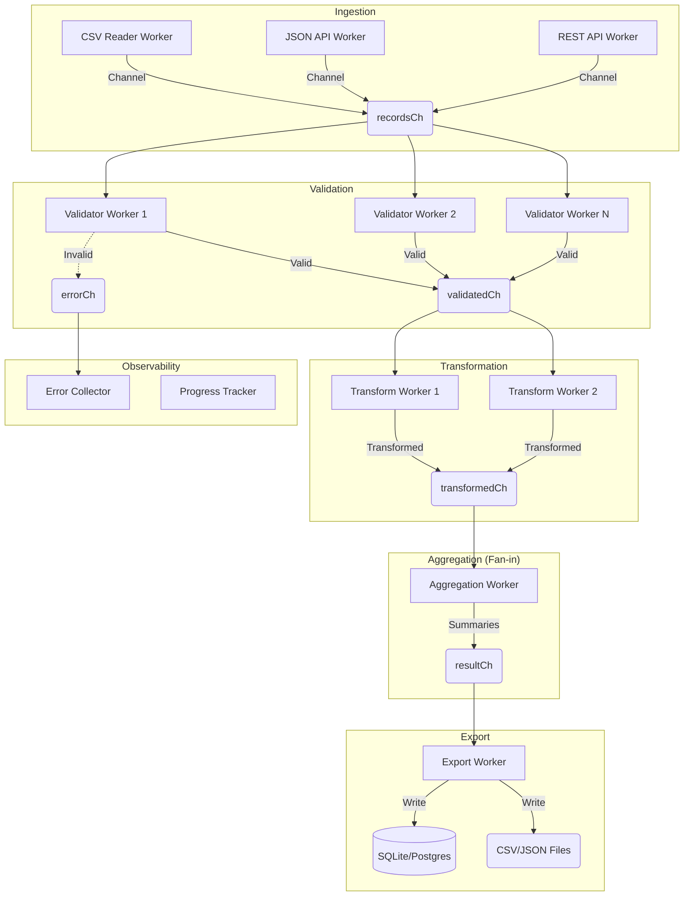

# Data Processing Pipeline (Go)

A robust, concurrent data processing pipeline built in Go. It ingests data from multiple sources (CSV, JSON, REST APIs), validates and transforms records, computes aggregations, and exports the results. The system is managed via a RESTful API and features full observability and graceful cancellation.

## Architecture & Concurrency Model

The application leverages Go's powerful concurrency primitives (Goroutines and Channels) to process data in a multi-stage, fan-out/fan-in pipeline architecture.

### Architecture Diagram



### Design Choices & Trade-offs (Short Report)

1.  **Clean Architecture:** The codebase is split into `cmd` (entry points), `internal/api` (HTTP transport), `internal/service` (business logic), and `internal/store` (data access). This separation of concerns allows for easy swapping of underlying databases and robust unit testing.
2.  **Concurrency Model:** 
    *   **Fan-out:** The validation and transformation stages use parameterized worker pools (fan-out). This allows CPU-bound tasks (like data parsing and math) to scale horizontally across CPU cores.
    *   **Fan-in:** The aggregation stage pulls from the transformation channel into a single worker (fan-in) to safely compute sums and averages without complex mutex locking.
3.  **Context for Cancellation:** `context.Context` is passed down through all layers. If a user cancels a job via the API, the context is cancelled, signaling all goroutines to gracefully shut down, preventing memory leaks and orphaned processes.
4.  **Trade-offs:** 
    *   *Memory vs Speed:* The current in-memory store for jobs is incredibly fast but volatile. For production, this will be swapped with SQLite/Postgres.
    *   *Channel Buffering:* Unbuffered channels provide strict synchronization but can block fast producers. We will tune channel buffer sizes to accommodate bursty data ingestion.

---

## Run Instructions

This project is fully containerized and uses Docker Compose.

1.  **Start the server:**
    ```bash
    docker compose up --build
    ```
2.  **Stop the server:**
    ```bash
    docker compose down
    ```

The API will be available via the NGINX reverse proxy at `http://localhost`.

### Running the Frontend UI
If you have the `ui` repository cloned, you can start the React frontend:
```bash
cd ui
npm install
npm run dev
```

### Running Tests & Code Coverage
The project uses Docker to run tests so you don't need Go installed locally.
To run the full test suite and output a code coverage report to the terminal:
```bash
make cover
```

---

## Example API Requests

### 1. Create a Pipeline Job
```bash
curl -X POST http://localhost/api/v1/pipelines \
  -H "Content-Type: application/json" \
  -d '{
    "sources": ["https://covid.ourworldindata.org/data/owid-covid-data.csv"],
    "export_targets": ["sqlite"]
  }'
```

### 2. List All Jobs
```bash
curl -X GET http://localhost/api/v1/pipelines
```

### 3. Get Job Details
```bash
curl -X GET http://localhost/api/v1/pipelines/mock-job-id
```

### 4. Check Job Progress & Metrics
```bash
curl -X GET http://localhost/api/v1/pipelines/mock-job-id/progress
```

### 5. Cancel a Running Job
```bash
curl -X PATCH http://localhost/api/v1/pipelines/mock-job-id/cancel
```